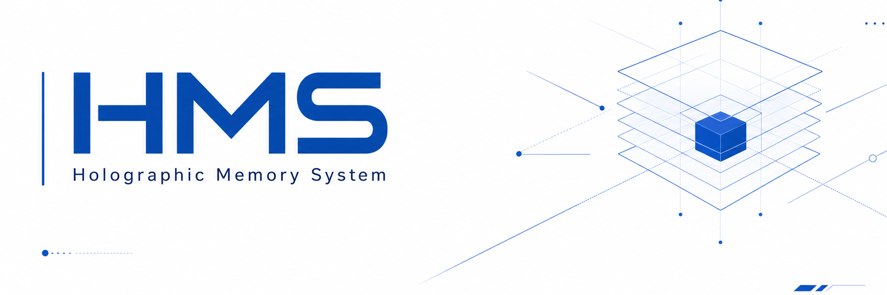

<div align="center">



### Structured Memory Intelligence for Reliable Long-Horizon Reasoning

<table>
  <tr>
    <td valign="middle"><strong>ShadowWeave Team</strong></td>
    <td width="74" align="center" valign="middle">
      
    </td>
  </tr>
</table>

<a href="https://arxiv.org/"></a>


[English](README.md) · [中文](README.zh-CN.md)

</div>

---

## Overview

The **Holographic Memory System (HMS)** is a structured long-term memory layer
for AI applications. It retains conversations and documents, extracts durable
facts, links related entities and events, and recalls relevant context for later
model calls.

HMS is designed for applications that need memory across sessions without
placing an entire conversation history into every prompt.

## Quick Start

Use the all-in-one local bundle (`core/local-suite`) to run HMS with embedded
PostgreSQL:

```python
from hms import HMSEmbedded

client = HMSEmbedded(
    profile="myapp",
    llm_provider="openai",
    llm_api_key="your-api-key",
)

# Use immediately - no manual server management needed
client.retain(bank_id="alice", content="Alice loves AI")
results = client.recall(bank_id="alice", query="What does Alice like?")
```

Or manage the server explicitly via `start_server()` / `HMSClient`, and use the
Python SDK (`interface/sdk/python`) for direct API access.

## Opt-in Image and Video Memory

The dataplane includes an opt-in `openai_multimodal` file parser. Images are
validated and normalized locally; videos are decoded locally into a bounded,
deterministic frame set. The visual description is rendered as grounded
canonical Markdown and then enters the existing document, chunk, embedding,
link, and recall pipeline. Raw video is never sent to the description provider.

The feature is disabled by default. Its current runtime support matrix is
PostgreSQL; enabling the media path with Oracle fails closed while ordinary HMS
Oracle support remains unchanged. Real-provider quality is a separate operator
qualification and is false by default. See the
[multimodal operator guide](docs/multimodal_memory.md) and the
[system architecture guide](docs/system_architecture_and_multimodal.md).

## Memory Flow

```text
Retain
  -> parse source content
  -> extract structured memories
  -> resolve entities and links
  -> store facts, chunks, and provenance

Recall
  -> analyze the query
  -> retrieve semantic, lexical, graph, and temporal candidates
  -> fuse and rerank evidence
  -> return grounded memory context
```

HMS keeps source provenance and temporal metadata alongside extracted memory,
so applications can inspect where recalled information came from and when it
was observed.

## Repository Layout

```text
.
├── core/
│   ├── dataplane/     # HMS API server (retain / recall engine)
│   ├── daemon/        # embedding worker
│   └── local-suite/   # all-in-one bundle (embedded PostgreSQL)
├── docs/
├── interface/
│   └── sdk/python/    # Python client
├── scripts/
├── .env.example
├── README.md
└── README.zh-CN.md
```

## Environment Setup

Create a local environment file:

```bash
cp .env.example .env
```

Configure the PostgreSQL connection, core model, retain model, and embedding
provider. Never commit the populated `.env` file.

## Core Configuration

| Role | Provider | Model | Base URL | API key |
| --- | --- | --- | --- | --- |
| Core memory reasoning | `HMS_API_LLM_PROVIDER` | `HMS_API_LLM_MODEL` | `HMS_API_LLM_BASE_URL` | `HMS_API_LLM_API_KEY` |
| Retain extraction | `HMS_API_RETAIN_LLM_PROVIDER` | `HMS_API_RETAIN_LLM_MODEL` | `HMS_API_RETAIN_LLM_BASE_URL` | `HMS_API_RETAIN_LLM_API_KEY` |
| Embeddings | `HMS_API_EMBEDDINGS_PROVIDER` | `HMS_API_EMBEDDINGS_OPENAI_MODEL` | `HMS_API_EMBEDDINGS_OPENAI_BASE_URL` | `HMS_API_EMBEDDINGS_OPENAI_API_KEY` |

The core and retain roles may use the same OpenAI-compatible endpoint. Embedding
configuration can use a separate provider or a local model.

### Optional Milvus semantic index

Set `HMS_API_VECTOR_INDEX_PROVIDER=milvus` to use Milvus for dense semantic candidate retrieval. The relational database remains canonical and continues to handle full-text/BM25, graph, temporal, fusion, reranking, SQL hydration, and fallback search.

```bash
export HMS_API_VECTOR_INDEX_PROVIDER=milvus
export HMS_API_MILVUS_URI=./hms_milvus.db  # Milvus Lite
# export HMS_API_MILVUS_URI=http://localhost:19530  # Milvus Server
# export HMS_API_MILVUS_TOKEN=your-token            # Zilliz Cloud or secured Server
```

After enabling Milvus for an existing database, rebuild its projection with `hms-admin rebuild-vector-index --yes`. Milvus Lite is intended for a single HMS process; use Milvus Server or Zilliz Cloud for multi-worker deployments. See [the dataplane README](core/dataplane/README.md#optional-milvus-semantic-index) for all settings and consistency guidance.

## Security Notes

- Keep `.env`, private keys, tokens, and populated credentials out of Git.
- Use separate internal and vendor-facing API keys.
- Use a stable tenant or bank boundary for each user or organization.
- Review gateway quotas and rate limits before exposing the service publicly.

## License

See the repository [MIT License](LICENSE), any component-specific package
metadata, and [THIRD_PARTY_NOTICES.md](THIRD_PARTY_NOTICES.md) for notices
covering included third-party code.
